# User Guide

# Introduction

This repository contains all automated tests for Katalon platform product and owned by Quality Engineering team

- Automation Tool: Katalon Studio (Platform Or Edition)
- Language: Groovy, Java
- Design Pattern: Fluent Page Object Model
- Support: API and UI application
- SUT/AUT: Katalon TestOps (Web Application, Rest APIs)

# **Prerequisites**

- Java 8+ installed already
- Katalon Studio installed already (latest version)

# **High-Level Design**

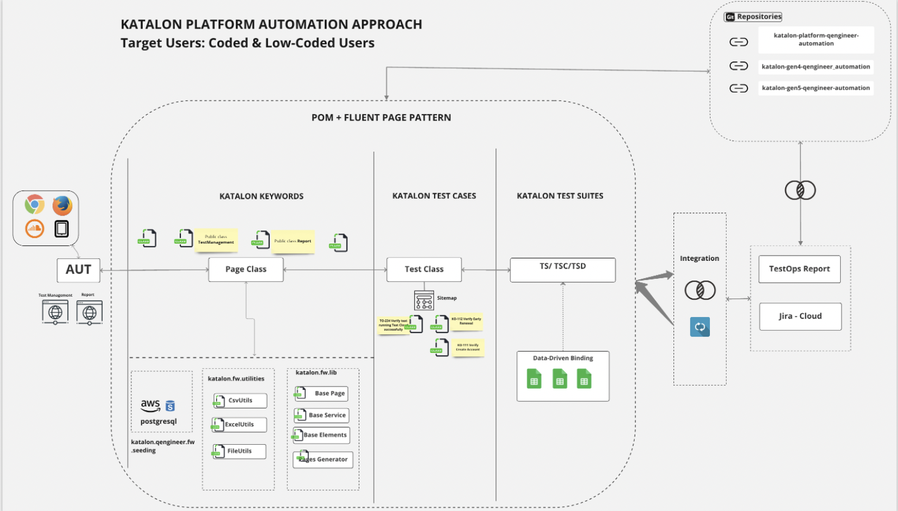

# **Usage**

## **UI Automation - Framework Structure**

### <ins> **Profile** </ins>
**Objectives**: Consists of test environment configuration/ global variables for running tests
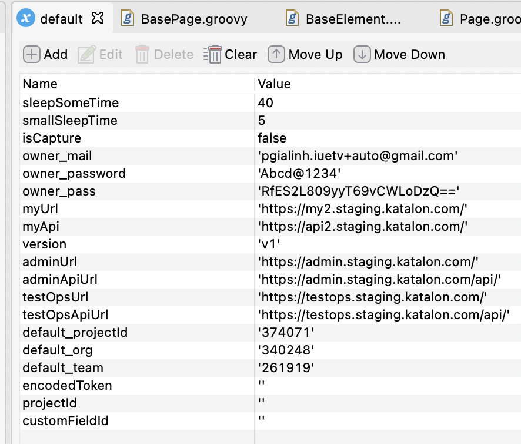

### <ins> **Keyword** </ins>
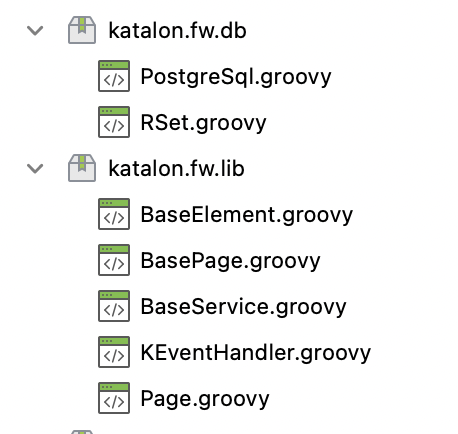
- `katalon.fw.*`: ***Using the keywords for building core framework function***
  - `BaseElement.groovy`: Define wrap-up methods of findTestObject from Object Repository to locate element on Page Object Classes (eg. class, id, link, name, css ...)
    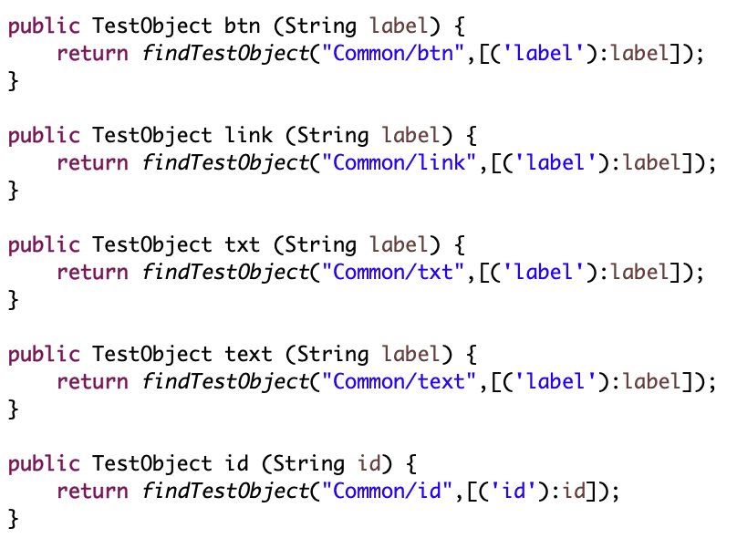
  #####
  - `Page.groovy`: Generate Page Object Classes leverage singleton design pattern in 2 forms (Lazy - *creation of instance at load time* & Early Instantiation - *creation of instance when required*) to help to save memory because object is not created at each request
    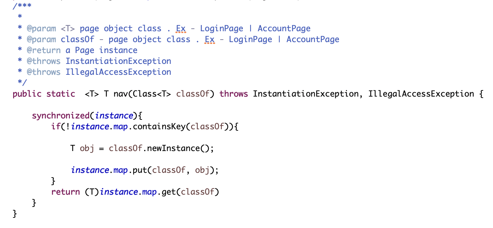
  #####
  - `BasePage.groovy`: Parent page for other page objects classes, contains common functions on many pages
    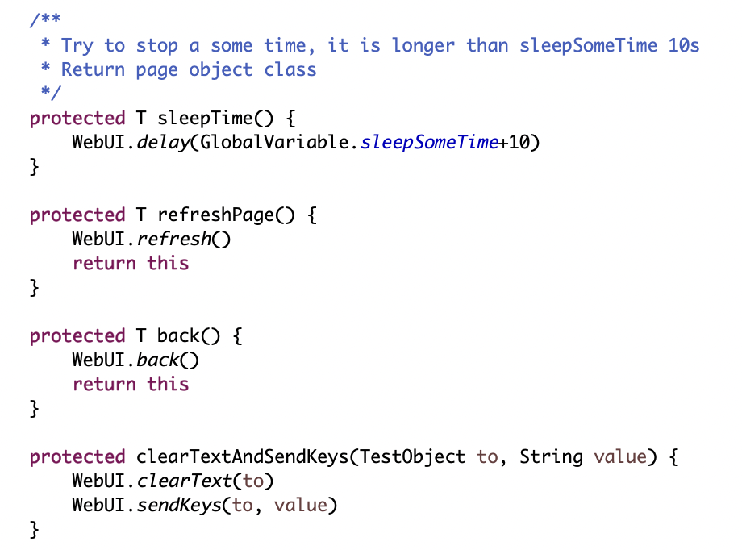
  #####
  - `KEventHandler.groovy`: Custom driver event handler listener to listen driver event log during running test
    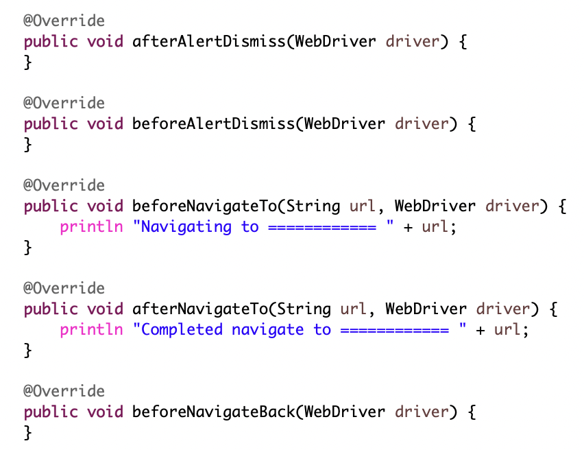

  #####
- `katalon.*<feature>.groovy`: ***Implement the Page Object Model (POM Pattern) to make the Test Objects (UI Objects) attached to their pages (Page Objects) to do the Web actions such as clicking a button or filling in a textbox***
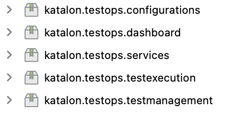
  - Those are organized based on the feature site maps and each class will be inherited from `BasePage` class
  - Must not contain utility functions, it should be implement as web element-action-based design
  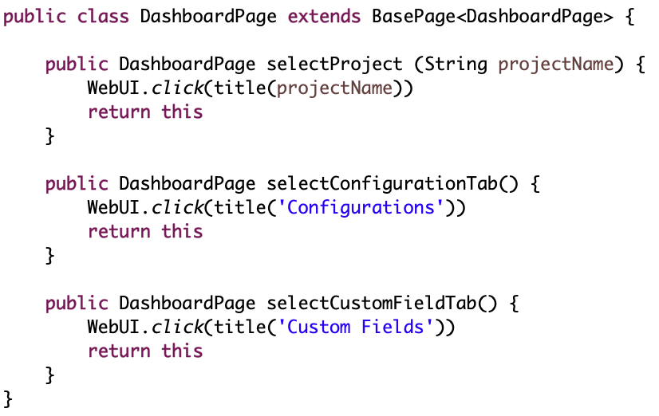

### <ins> **Object Repository** </ins>

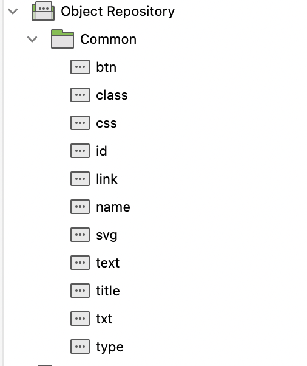
- **Objective**: To avoid object duplication during development time and help to reduce performance issue, as well as simply the way to define test objects
- **Recommendation**: The Scripter should try to use dynamic element to avoid creating too many test objects.
- **Usages**:  
  * btn: To locate Button element, only need input label of button which want to locate to
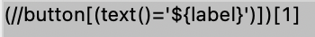
  * class: To locate element by class attribute, only need input class name of element which want to locate to
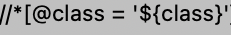
  * name: To locate element by name attribute, only need input name attribute value of element which want to locate to                                                                            
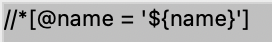                                       
  * id: To locate element by id attribute, only need input id of element which want to locate to   
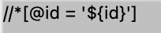
  * link: To locate a link element with tag name 'a', only need input link text of element which want to locate to   
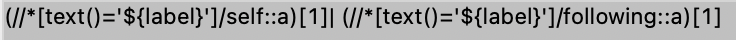
  * text: To locate element by text, only need input text value of element which want to locate to   
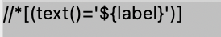
  * txt: To locate checkbox element by checkbox label, only need input checkbox label value of element which want to locate to   
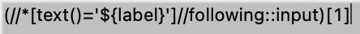
  * title: To locate element by title attribute, only need input title value of element which want to locate to   
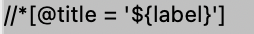
  * css: To locate element by css                                                                                         
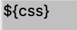

### <ins> **Test Cases** </ins>
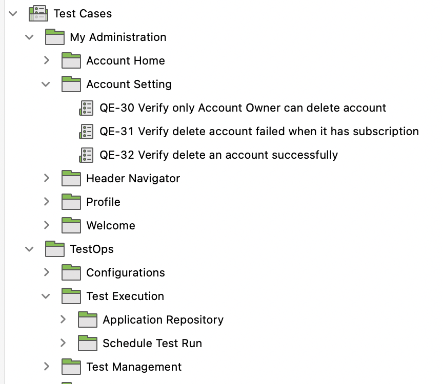
- Test scripts are organized based on the site maps. For examples, test cases for Application Repository feature should be stored under Testops > Test Execution > Application Repository folder.
- **Usages**: 
  - Required follow naming convention as [automation practices](https://katalon.atlassian.net/wiki/spaces/ENG/pages/2354249760/WIP+Automation+Practices)
  - Test case design follow Fluent Page Object Model
  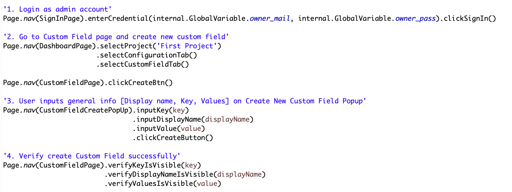

### <ins> **Test Data | Data Files** </ins>
- **Objectives**: Contains all of data-driven test for automated tests, leveraging excel file to store data, and organized follow site map of AUT
- **Usages**:
  - Each WorkBook represent for a feature (eg. TestManagement, Configurations, etc.)
  - Each WorkSheet represent for a test script, sheet name is required the same name as test case id (eg. AC-FA38401)
- Screenshot: TBD

### <ins> **Test Listener** </ins>

- Handle test hook actions(@BeforeTestCase, @AfterTestCase, @BeforeTestSuite, @AfterTestSuite...)
### <ins> **Test Suites: TBD** </ins>

## **API Automation** 
### <ins> **Structure** </ins>
- Leverage UI automation structure, applying Fluent Page Object Model and organizing structure as site maps of UAT
- **BaseService.groovy**: 
  - Objectives: contains common functions for API endpoint testing (eg. set baseUrl, set Auth, setPayload, setMethod, ect.), it will be inhered from services pages
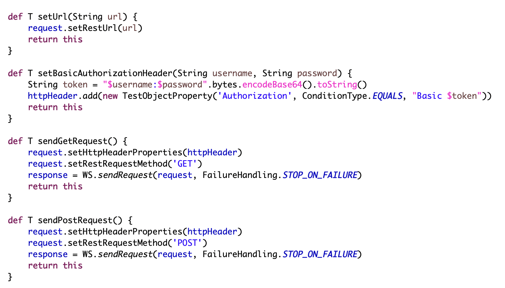
- `katalon.service.*.groovy`: 
  - Objectives: contains all api service pages classes, those are also organized based on the feature site maps
  - Usages: Design test follow fluent pattern, **remember to `.initRequestObject()` to initialize request instance**
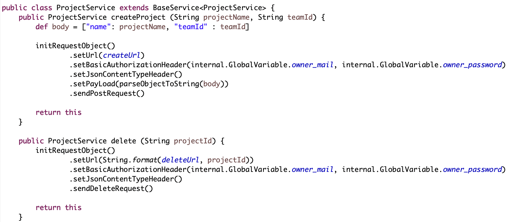
- **Testcases**: The same UI, test cases are organized follow feature site maps or UAT
  - Usages: 
    - Test case design follow Fluent Page Object Model and test case convention as UI test case mention
    - Leverage **Page** class to generate Page Service class 
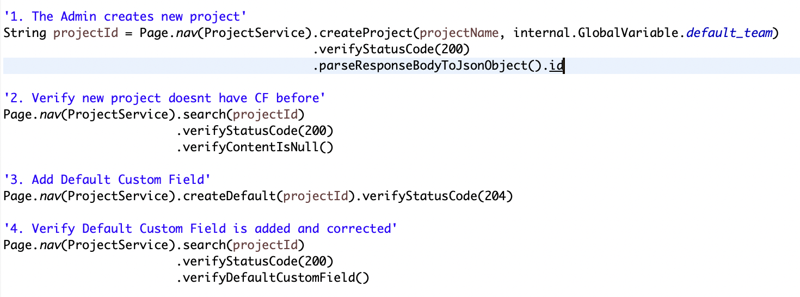
# Report: *(TBD)*
# Reference Sources
- [Automation practices](https://katalon.atlassian.net/wiki/spaces/ENG/pages/2354249760/WIP+Automation+Practices)

